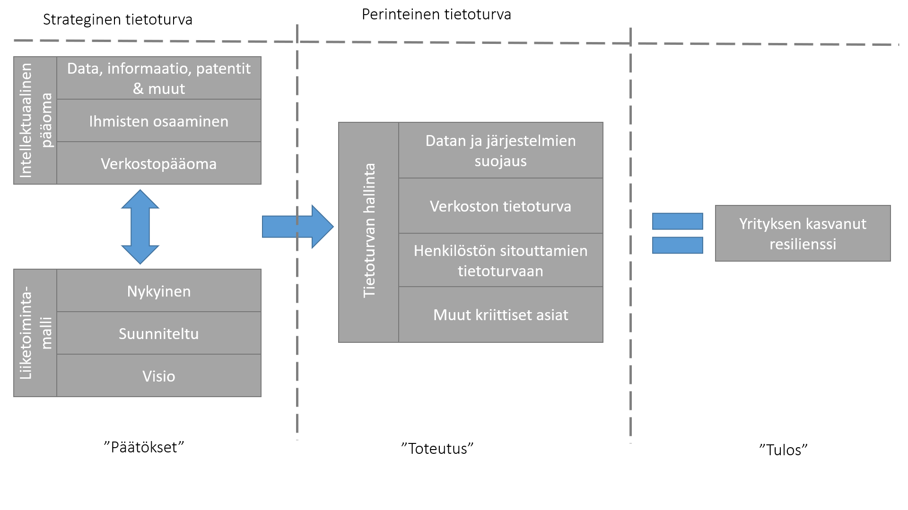

# Kyberturvan hallinta liiketoiminnan kasvaessa ja digitalisoituessa

Tämä luku on tarkoitettu erityisesti kasvaville yrityksille ja
firmoille, joiden liiketoiminnassa digitalisaatio on keskeinen tekijä.
Yhteistä tällaisille yrityksille on kasvava tarve erityisesti korkean
osaamiseen ja tietoon, sekä niiden systemaattiseen hallintaan.
Tietoturva on näissä tapauksissa tarpeen liittää osaksi yrityksen
strategiaa.

## Tietoturva strategiana -- ei erillisenä teknisenä toimenpiteenä

Strategisen tietoturvan tulee tukea perustellusti yrityksen
liiketoimintamallia. Perinteisen tietoturvan lisäksi tämä sisältää
kysymykset esimerkiksi tiedon jakamisesta ja
liiketoimintakriittisyydestä sekä ihmisten toimintaan liittyvät
kysymykset, kuten tietosuojan, henkilökunnan sitouttamisen ja
hyvinvoinnin koko liiketoimintaverkosto huomioiden.

Tietoturva nähdään usein teknisinä ja taktisina toimenpiteinä, joiden
tarkoituksena on organisaatioon liittyvien tietojen, järjestelmien ja
toimintojen suojaaminen. Kyberturvallisuuden huomiointi tällä tavoin on
edellytys ja jopa itsestäänselvyys, jotta yritys voi toimia nykyisen
kaltaisessa digitalisoituneessa ympäristössä. Tämä näkökulma on
kuitenkin rajoittunut ja sen rinnalle tarvitaan myös strategisen tason
ymmärrys, jos halutaan luoda tietoturvasta kilpailuetu ja kehittää
yritystä vastaamaan digitalisaation haasteet kestävästi. Strategisessa
tietoturvallisuudessa keskiössä ei ole vain yrityksen suojaaminen.
Strategisessa tietoturvallisuudessa keskitytään strategisiin
mahdollisuuksiin, joita voidaan tuoda liiketoimintaan ja sen
kehittämiseen turvallisesti. Kun tietoturvassa kysymys on miten ja mitä
suojataan, strategisessa tietoturvallisuudessa keskiössä on mitä
haluamme tehdä ja miten se mahdollistetaan turvallisesti yrityksen
toimintaympäristössä sekä huomioidaan yrityksen
liiketoimintasuunnitelmassa.

Myös tarkastelun taso on korkeampi. Tietoturva perinteisesti keskittyy
yrityksen järjestelmiin ja niiden suojaamiseen, kun taas strateginen
tietoturvallisuus tulee nähdä laajempana toimintana, joka ylettyy
ekosysteemeihin/verkostoihin joihin yritys kuuluu ja osallistuu.

## Liiketoiminnan tavoitteet nyt ja tulevaisuudessa määrittelevät tietoturvan suuntaa

Tietoturva ei ole irrallinen osa, jota voi käsitellä liiketoimintamallia
huomioimatta, vaikka useassa tapauksessa näin käytännössä toimitaan.
Yrityksen liiketoimintaidea ja sen toteutus on lopulta se ydinasia, mikä
määrittää mitä erilaisia toimia yrityksessä tulee tehdä, myös
tietoturvaan liittyen. Liiketoiminnan asettamat reunaehdot ovat
erilaisia eri organisaatioissa ja täten ne tulee huomioida
tapauskohtaisesti. On eri asia pohtia pienen luomutilan
tietoturvaratkaisuja kuin esimerkiksi verkkokaupparatkaisuja tarjoavan
yrityksen kohdalla. Kun ensimmäisellä voi riittää, että sen käytössä
olevassa tietokoneessa on ajantasainen ja päivitetty ohjelmisto,
toisella taas tulee olla vahva osaaminen ja kyky suojata tarjoamiensa
palvelujen turvallisuus. Lisäksi liiketoiminnan tavoitteet eivät ole
stabiileja, vaan yrityksillä on myös tulevaisuuden suunnitelmia niin
lyhyelle kuin pitkälle aikavälille. Näiden tavoitteiden huomioiminen
tietoturvassa mahdollistaa myös pitkäjänteisempää ja systemaattisempaa
tietoturvan toteuttamista ja riskien ennakointia myös liiketoiminnan
muuttuessa.

## Tieto, osaaminen ja niiden verkostoituva luonne strategian näkökulmasta

Ensimmäisiä asioita strategisessa tietoturvassa on tarkastella mikä on
yrityksen strategia ja minkälaisia resursseja sen toteuttamiseen
tarvitaan (katso kuva). Tieto ja osaaminen ovat nykyisessä
yritysmaailmassa keskeinen osa yrityksen resursseja. Ongelmana on
kuitenkin se, että yrityksen omaisuus nähdään usein vain fyysisinä
omaisuuslajeina. Todellisuudessa patenttien ja muiden immateriaalisten
omaisuuksien (ei-rahallinen pääoma) arvon merkitys on monesti suurempi
kuin perinteisen pääoman. Ongelmana on että yrityksen kriittisimmän
"omaisuuden" eli tiedon ja osaamisen arvo on vaikeammin määriteltävissä
ja siksi usein ohitettu tai huonosti kuvattu. Tämä pääoma kuitenkin on
se kriittinen komponentti, joka mahdollistaa arvon luonnin yrityksessä
ja sen tarkastelu tulisikin ottaa strategisen tietoturvallisuuden
ytimeen. Tiedon merkityksen ja osaamisen kartoitukseen löytyy jo
olemassa olevia työkaluja ja menetelmiä (kts. esim.
theodi.org/knowledge-opinion/guides/).

Osaaminen nousee myös keskeiseen osaan erityisesti pienissä ja
keskisuurissa yrityksissä, joissa osaaminen voi olla usein yksittäisten
ihmisten hallussa. Tästä nouseekin esiin tarve osaamisen jakamiselle
ihmisten kesken. Samoin henkilöstön sitouttamiseen ja työntekijöiden
hyvinvointiin tulee kiinnittää erityistä huomiota, jotta yrityksen
kriittistä osaamista ei menetetä.

Strategisessa kyberturvassa tulisi olla keskiössä erityisesti se, miten
tietoa käytettään turvallisesti, ei vain se miten tietoa voidaan suojata
tai eristää. Erityisesti dataan perustuvan talouden kasvu ja leviäminen
yhä laajemmin eri liiketoiminta-alueille korostaa tarvetta ymmärtää
datan merkitystä organisaatiolle ja sen kilpailukyvylle----yrityksen
jatkuvuudelle.

Datan arvo kasvaa sitä mukaa kun sitä pystytään lisäämään, rikastamaan
ja sitomaan liiketoimintaan. Tämä korostuu verkostoituneessa
liiketoiminnassa, jossa yritykset ovat enemmän ja enemmän riippuvaisia
esimerkiksi tiedon jakamisesta toimitusketjuissaan. Eli tiedon
hyödyntäminen tapahtuu dataekosysteemissä, joka menestyy vain
kokonaisuutena, organisaatioiden yhteistyöhön perustuen.

